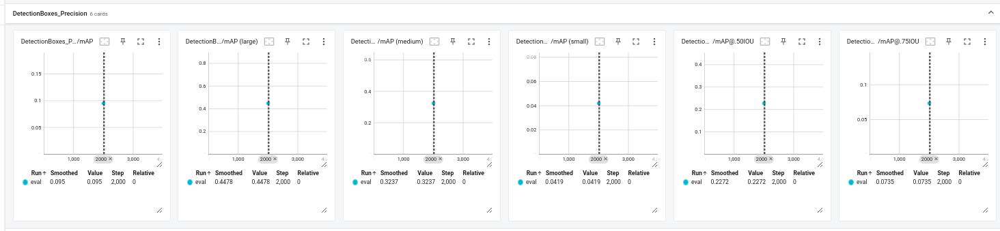
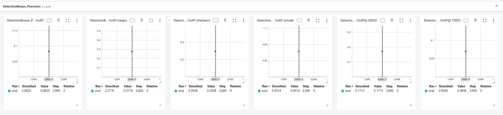
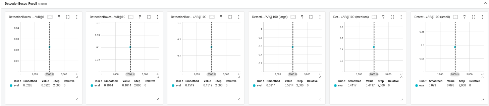
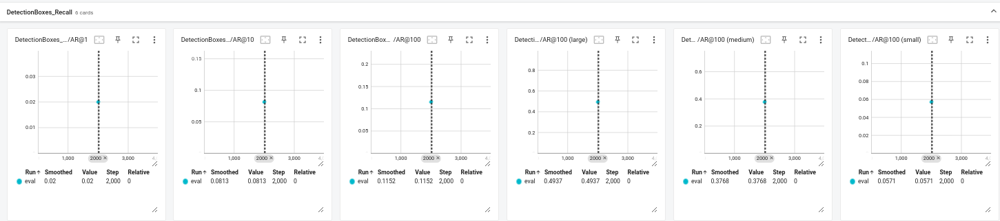
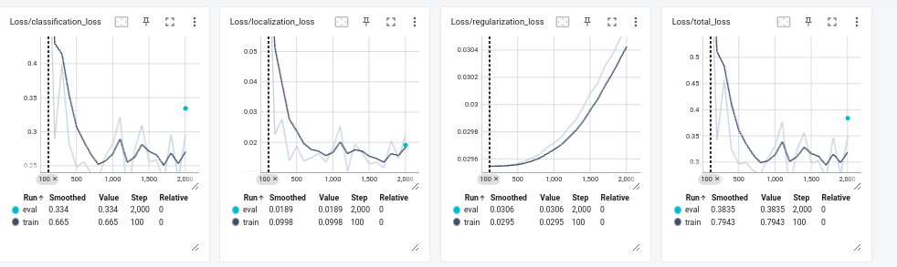
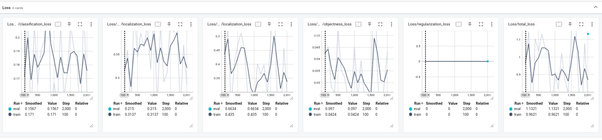
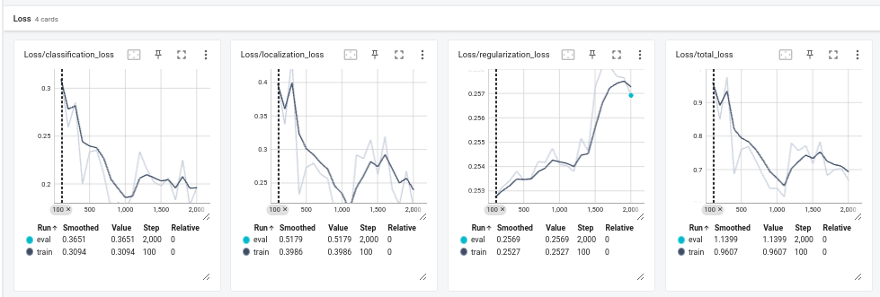
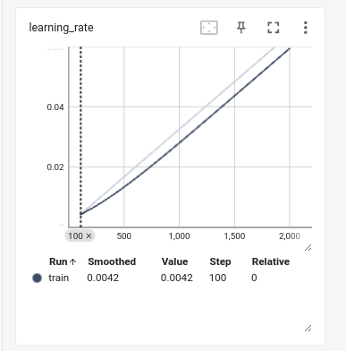
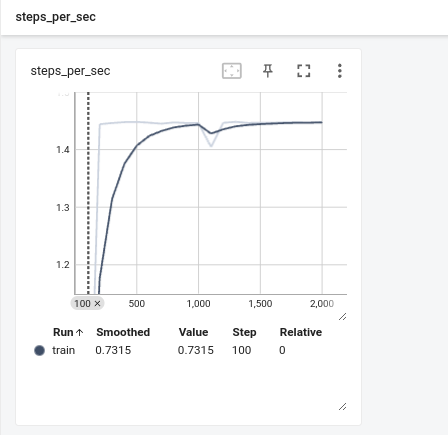

## Precision Comparison

| Metric                                 | **EfficientDet** | **Faster R-CNN ResNet152** | **SSD ResNet50** |
| -------------------------------------- | ---------------------- | -------------------------------- | ---------------------- |
| **Mean Average Precision (mAP)** | **0.095**        | 0.082                            | 0.079                  |
| **mAP (large)**                  | **0.4478**       | 0.2776                           | 0.3326                 |
| **mAP (medium)**                 | **0.3237**       | 0.2928                           | 0.3048                 |
| **mAP (small)**                  | **0.0419**       | 0.0314                           | 0.0251                 |
| **mAP @ 0.5 IOU**                | **0.2272**       | 0.1713                           | 0.1499                 |
| **mAP @ 0.75 IOU**               | **0.0735**       | 0.0696                           | **0.0771**       |

### Observations

**EfficientDet** :

* Achieves the highest overall precision, leading in mAP across all object sizes.
* Excels particularly in detecting large objects (mAP: 0.4478) and performs strongly for medium and small objects as well.
* Outperforms others in mAP @ 0.5 and 0.75 IOU thresholds, making it the most suitable for high-precision tasks.

**Faster R-CNN ResNet152** :

* Provides balanced results but consistently ranks behind EfficientDet.
* Better than SSD ResNet50 for small objects and competitive for medium objects.
* Slightly lower precision at IOU thresholds compared to EfficientDet, reducing its suitability for precision-critical applications.

**SSD ResNet50** :

* Has the lowest precision overall, particularly struggling with small objects (mAP: 0.0251).
* Performs moderately well for large objects (mAP: 0.3326) and shows competitiveness at mAP @ 0.75 IOU.
* More suitable for real-time applications but lacks high-precision capabilities.

### Summary

**EfficientDet** is the most precise model across all object sizes and IOU thresholds, making it ideal for tasks requiring high precision. **Faster R-CNN ResNet152** offers a balanced performance but falls short of EfficientDet**. SSD ResNet50** is best suited for real-time scenarios but struggles with precision, particularly for small objects.

The best model in terms of precision is  **EfficientDet** .

## Recall Comparison

| Metric                    | **EfficientDet** | **Faster R-CNN ResNet152** | **SSD ResNet50** |
| ------------------------- | ---------------------- | -------------------------------- | ---------------------- |
| **AR@1**            | 0.0226                 | 0.0208                           | 0.02                   |
| **AR@10**           | 0.1014                 | 0.0891                           | 0.0813                 |
| **AR@100**          | 0.1519                 | 0.1179                           | 0.1152                 |
| **AR@100 (large)**  | 0.5814                 | 0.5075                           | 0.4937                 |
| **AR@100 (medium)** | 0.4417                 | 0.3831                           | 0.3768                 |
| **AR@100 (small)**  | 0.093                  | 0.06                             | 0.0571                 |

### Observations

**EfficientDet:**

* Outperforms the other models in all recall metrics, achieving the highest scores across object sizes.
* Particularly strong in detecting **large objects** (AR@100 (large): 0.5814) and **medium objects** (AR@100 (medium): 0.4417).
* Shows reasonable performance on  **small objects** , though small objects remain challenging (AR@100 (small): 0.093).

/logs/images/Recall.png)

**Faster R-CNN ResNet152:**

* Offers balanced performance but falls behind EfficientDet across all categories.
* Performs moderately for **large objects** (AR@100 (large): 0.5075) and **medium objects** (AR@100 (medium): 0.3831).
* Recall for **small objects** (AR@100 (small): 0.06) is better than SSD ResNet50 but still significantly lower than EfficientDet.

**SSD ResNet50:**

* The lowest recall in all metrics, particularly for **small objects** (AR@100 (small): 0.0571).
* Performs comparably to Faster R-CNN for **large objects** (AR@100 (large): 0.4937) and **medium objects** (AR@100 (medium): 0.3768).
* Best suited for real-time applications but at the cost of recall performance.

### Summary

**EfficientDet** is the best model regarding recall, offering the highest scores across all object sizes and metrics. **Faster R-CNN ResNet152** follows as a balanced option, while **SSD ResNet50** is the least effective in recall but may still be useful for real-time applications.

## Loss(eval/train) Comparison

| Loss Type                     | **EfficientDet** (eval/train) | **Faster R-CNN ResNet152** (eval/train) | **SSD ResNet50** (eval/train) |
| ----------------------------- | ----------------------------------- | --------------------------------------------- | ----------------------------------- |
| **Classification Loss** | 0.334 / 0.665                       | 0.1567 / 0.171                                | 0.3651 / 0.3094                     |
| **Localization Loss**   | 0.0198 / 0.0998                     | 0.215 / 0.3137                                | 0.5179 / 0.3986                     |
| **Regularization Loss** | 0.0306 / 0.0295                     | 0.0 / 0.0                                     | 0.2569 / 0.2527                     |
| **Total Loss**          | 0.3835 / 0.7943                     | 1.1321 / 0.9621                               | 1.1399 / 0.9607                     |

### Observations

**EfficientDet:**

* Achieves the **lowest total loss** for both evaluation and training phases (0.3835 / 0.7943).
* Excels in **classification** and  **localization losses** , with notably lower values compared to the other models.
* Regularization loss is slightly higher than Faster R-CNN ResNet152 but lower than SSD ResNet50.

**Faster R-CNN ResNet152:**

* Shows moderate total loss values (1.1321 / 0.9621).
* Demonstrates competitive  **classification loss** , being the lowest among the three models.
* Suffers from relatively higher **localization loss** compared to EfficientDet.

**SSD ResNet50:**

* Has the **highest localization loss** (0.5179 / 0.3986) among the three models, indicating potential challenges in accurately localizing objects.
* Total loss (1.1399 / 0.9607) is slightly higher than Faster R-CNN ResNet152 but comparable.
* Classification loss is higher than Faster R-CNN but comparable to EfficientDet in the evaluation phase.

### Summary

**EfficientDet** is the best-performing model regarding evaluation and training loss, showcasing the lowest total loss and strong performance in both classification and localization losses. **Faster R-CNN** ResNet152 offers balanced performance, while **SSD ResNet50** struggles with higher localization loss, making it less effective in loss minimization.

* **Best in Evaluation Loss** : **EfficientDet**
  It has the lowest **evaluation total loss** (0.3835), significantly outperforming both Faster R-CNN ResNet152 and SSD ResNet50.
* **Best in Training Loss** : **EfficientDet**
  It also has the lowest **training total loss** (0.7943), indicating better optimization during the training phase.

## Learning Rate Comparison

| Metric                  | **EfficientDet** (Model 1) | **Faster R-CNN ResNet152** (Model 2) | **SSD ResNet50** (Model 3) |
| ----------------------- | -------------------------------- | ------------------------------------------ | -------------------------------- |
| **Learning Rate** | 0.0042                           | 0.0147                                     | 0.0147                           |

### Observations

1. **EfficientDet (Model 1):**

   * Utilizes the **lowest learning rate** (0.0042), indicating a more conservative and stable approach during training.
   * This approach reduces the risk of overshooting the optimal solution in early training stages.

   
2. **Faster R-CNN ResNet152 (Model 2)** and **SSD ResNet50 (Model 3):**

   Both share a higher learning rate (0.0147), which may allow for faster convergence but increases the risk of instability during training.

   /logs/images/Learning_Rate.png)   /logs/images/Learning_Rate.png)

### Summary

**EfficientDet** is the best in terms of learning rate, as its lower value provides better stability during training, ensuring smoother and more controlled optimization.

## **Steps per Second** Comparison

| Metric                     | **EfficientDet** (Model 1) | **Faster R-CNN ResNet152** (Model 2) | **SSD ResNet50** (Model 3) |
| -------------------------- | -------------------------------- | ------------------------------------------ | -------------------------------- |
| **Steps per Second** | 0.7315                           | 0.7909                                     | **1.3735**                 |

### Observations

1. **EfficientDet (Model 1):**

   * Processes the fewest steps per second (0.7315), indicating it is the slowest model in terms of training speed.
   * Likely due to its higher computational complexity or heavier model architecture.

     
2. **Faster R-CNN ResNet152 (Model 2):**

   * Performs slightly better than EfficientDet, achieving 0.7909 steps per second.
   * Balances between computational complexity and processing speed but is still slower than SSD ResNet50.
     /logs/images/Steps_per_Sec.png)
3. **SSD ResNet50 (Model 3):**

   * Processes the highest number of steps per second (1.3735), making it the fastest model for training.
   * This speed advantage reflects its lightweight architecture, optimized for real-time applications.

   /logs/images/Steps_per_Sec.png)

### Summary

**SSD ResNet50** is the best model regarding steps per second, achieving the fastest training speed due to its lightweight design. **EfficientDet** is the slowest, likely due to its computational complexity, while **Faster R-CNN ResNet152** offers moderate performance in terms of training speed.

## Results

### **1. EfficientDet (Model 1):**

### 2. **Faster R-CNN ResNet152 (Model 2):**

### 3. **SSD ResNet50 (Model 3):**

## Conclusion and Recommendation

* **Precision** : **EfficientDet** achieves the highest precision across all object sizes and metrics.
* **Recall** : **EfficientDet** excels in recall, outperforming others in all object sizes.
* **Steps per Second** : **SSD ResNet50** is the fastest model for training, making it ideal for real-time applications.
* **Learning Rate** : **EfficientDet** uses a conservative and stable learning rate, ensuring smoother optimization.

### Recommendation:

**EfficientDet** is the recommended model for tasks requiring high accuracy (precision and recall) and stable training. However, if training speed or real-time deployment is critical, **SSD ResNet50** can be considered.
